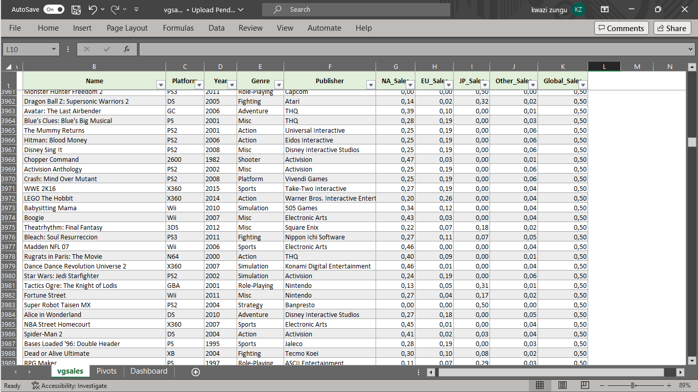
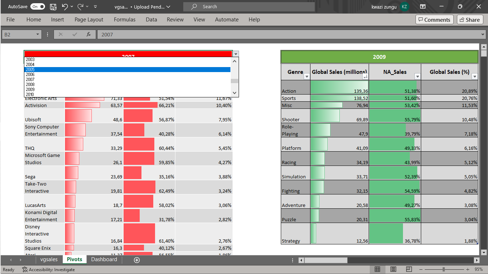
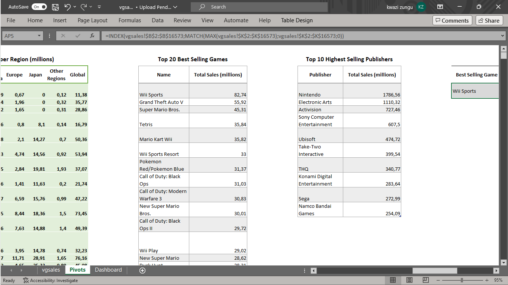
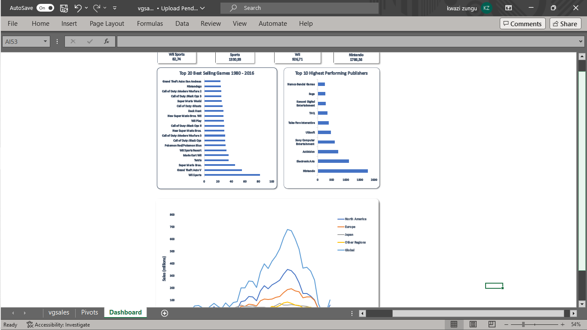
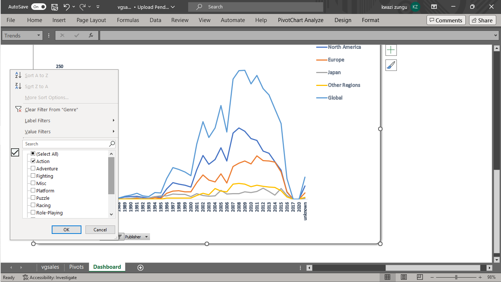

# Video Game Sales

## 1. Summary

This repository features the analysis of data on video game sales for the period of 1980-2020. Note that all of this analysis is exploratory, no predictive analysis was performed, as this is intended for those interested in knowing about the historical sales trends of video games and their various platforms.

**Note** that the data for the period of 2017-2020 has been found to be spotty, irrelevant and missing during the cleaning phase. So the analysis is only valid for **1980-2016**, however, this results obtained should not be taken as facts as well since all the information here is dependent on the data _([OriginalData.csv](OriginalData.csv))_ and not much from any other external sources.

## 2. Important Files

### 2.1 OriginalData.csv

_[OriginalData.csv](OriginalData.csv)_ contains the original data which serves as a basis for all the analysis performed. The file is a _.csv_ extension with the data containing _16599_ active rows and _11_ columns.

Columns include:

1. **Rank**
2. **Name** - Name of the video game
3. **Platform** - Gaming platform
4. **Year**
5. **Genre**
6. **Publisher** - Company responsible for publishing the game
7. **NA_Sales** - Sales in the North American region (in millions)
8. **EU_Sales** - Sales in the European Union (in millions)
9. **JP_Sales** - Sales in Japan (in millions)
10. **Other_Sales** - Sales in other regions (in millions)
11. **Global_Sales** - Total sales around the world

### 2.2 vgsales.xslx

_[vgsales.xlsx](vgsales.xlsx)_ is the main worksheet throughout this project. This **_Microsoft Excel Worksheet_** contains various summaries, tables and graphs to help in querying the data as you will see in detail on the next section.

## 3. An Overview of the Sheets on the Excel Workbook ([vgsales.xlsx](vgsales.xlsx))

### 3.1 vgsales

This sheet hosts the _vgsales_ table which contains a cleaned version of the data. With _16573_ rows and _10_ columns, duplicates were removed and data types corrected for relevant data fields. You can of course filter and play around with the table.

### 3.2 Pivots

_Pivots_ is the most essential sheet, as it consists of all the pivot tables created during this project.
The first 4 tables (_Publisher_, _Genre_, _Platform_, _Region_) are filtered to display data for any chosen year.
For example, in the 1st table, _Publisher_, select the cell above the headers with the year written on it, select the dropdown button on the right side of the cell and scroll through to select whichever year you want. This will show you data on the sales for each publisher for that particular year, and you can always filter this to see which publishers had the highest/lowest sales that year.
The same can be done for the other 3 tables, as they serve the purpose of providing information about how each platform, publisher, genre, etc performed in that period of time.
In the picture shown above, for instance, we can see that in 2009, action was the most popular genre making about _~21%_ of all sales that year, with _~51%_ of these sales in America.

The remaining tables serve as a basis for visualisations or graphs. These are self explanatory and feel free to check them out as you like.

### 3.3 Dashboard

 

A collection of all relevant visuals. Again, these are self explanatory, however it should be noted that sales trends for 2017-2020 are severely lacking due to corruption in the original data. There is also an unknown section of years which shows sales data for unrecorded years.

In the trends graph you can use field buttons on the bottom left to help filter the graphs by publisher, platform, game, etc. This is very useful for visualising the performance of these section over time.

## 4. Conclusion

There is definitly more we could've done with this data, I had lots of fun working with it and it wasn't too demanding as I used MS Excel which is a tool used by most business analysts in their everyday use.
The tables and visualisations provide nice summaries for the data.
