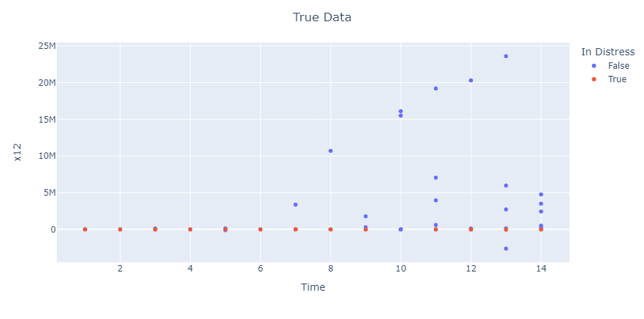
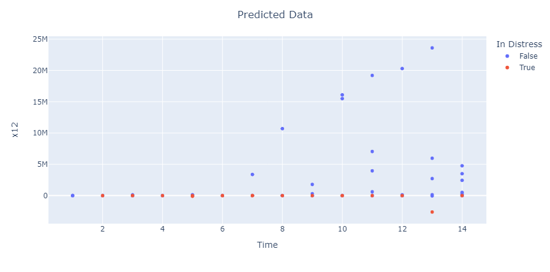

# Financial Distress

## 1. Summary

In this project we focus on using predictive analysis to figure out which companies will be in financial distress depending on their characteristics. From the dataset that's analysed, you will notice that dummy/abstract labels are used for the data, i.e. Company names are labelled company 1, company 2, etc. Regardless, the analysis is still very useful as the algorithm can easily be applied to data containing real companies with all their features in avail.

For this analysis, the **Support Vector Machine Algorithm** is used, taking advantage of scikit-learn's **Support Vector Classifier** method. The **SVM** was chosen because because the data contains dozens of features and this algorithm has been favoured for these types of applications.

Feel free to tackle the code yourself, and see how this algorithm fares against other machine learning methods, or improve on it as you see fit. I would love to view your analysis.

## 2. Relevant Files

Let's take a brief look at some relevant featured files in this projects

### (a) Financial_Distress.csv

[Financial_Distress.csv](Financial_Distress.csv) contains the original data, raw and unedited. Useful for referencing and reproducing, or improving, on the processes performed in this project.

### (b) requirements.txt

[requirements.txt](requirements.txt) is a typical requirements file in software engineering, which is composed of packages and software required to run the given code.
Thankfully, a lot of the packages used are common community softwares and you should have no problem installing them on your machine.

### (c) main.ipynb

[main.ipynb](main.ipynb) is a python jupyter notebook file where all of our coding and analysis takes place. Familiarity with python is required of course but the code has been divided into sections:

1. Packages
2. Initialise Data
3. Model
4. Testing

for the code to be easy to read.

## 3. Dataset Structure

The data contains _3673_ rows with _86_ columns.

- The **first row** is the header.
- **First column**, called **Company** lists all the companies, with _422_ companies in total (note the companies are listed/labelled as numbers).
- **Second column**, called **Time** shows the time periods, also labelled as numbers.
- **Third column**, called **Financial Distress** tells us about the financial distress level of the company at that period in time. Although this is shown as random floating numbers, note that if the value in this column is less than _-0.5_ then the company is in distress but it is healthy otherwise.
- The remaining _83_ columns, called **'x1', 'x2', ..., 'x83'** are features for each company at each time period.

As an example on how to read this data using the first _3_ columns,
company _1_ was financially healthy at time _3_ but it was in distress at time _4_.

## 4. Machine Learning Algorithm To Use

The [Support Vector Machine](https://scikit-learn.org/stable/modules/svm.html) algorithm is being used for this data, due to the multi-dimensional nature of the input variable/features.
For the model's setup, we use the **SVC (Support Vector Classifier)** method provided by Scikit Learn. sk-learn is considered as community standard so every action here is easy to replicate.

For the model setup ( feel free to study the code on how this was achieved ):

- Input data, **X**, consists of the _83_ features columns and the _Time_ column.
- Output data, **Financial Distress** or **y**, consists of dummy values _True_ and _False_, where _True_ indicates that a company is in distress at that period.
- _70%_ of the overall data is used for training, while the remaining _30%_ is being used for testing ( Data points chosen at random ).
- The **Regularization Parameter (C)** can be found using an optimisation method called _Grid Search_, _C=1_ is the best estimate obtained for the parameter.
- The **_linear_** **kernel function** is being used for this model as it best fits the current data ( This was discovered through trial and error ).
- Below is a graph representing the actual values for the _30%_ test data consisting of _1102_ data points or predictions:  _Time_ and _x12_ are arbitrary choices for plot variables, any of the **X** columns/features can be plotted against each other.

## 5. Results

A **Sample**, for our purposes can be defined as any company at a specific period of time. For example, the sample described as company _1_ at time _3_ was predicted to be financially healthy.

- _1102_ predicitions were made by the model (this can also be taken as the number of samples). _1053_ or _95.55%_ of samples were predicted to be financially healthy and _49_ or _4.45%_ were predicted to be in financial distress.
- The model predicted financially healthy samples with an accuracy of _~97%_ and the prediction for samples in distress was only _~48%_ accurate. The overall accuracy was _~95%_. _Possible signs of overfitting_.
- _1040_ or _94.37%_ of the samples were correctly predicted to be healthy, _12_ or _1.09%_ were correctly predicted to be in distress, _13_ or _1.18%_ were falsely predicted to be in distress and _37_ or _3.36%_ were falsely predicted as healthy.
- Below is a plot for the predicted data for visual comparison along with the plot on the previous chapter: 

## 6. Recommendations
